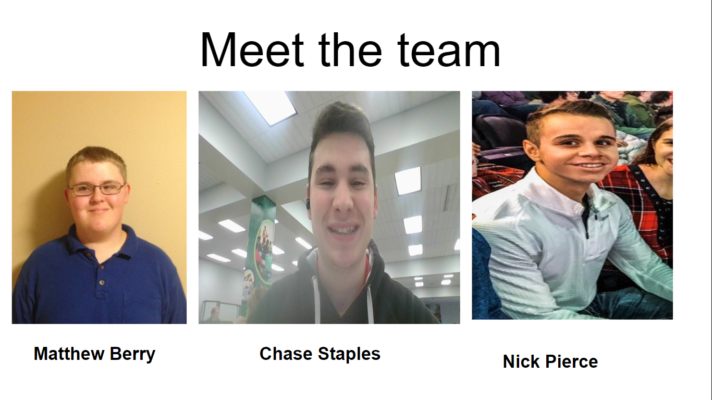

# Web apps and Services -03

## Group one Team members:
- Chase Staples
- Nick Pierce
- Matthew Berry





 ## Useful knowledge
 Topic: Advnced Git

 [Repo link](https://github.com/Infraction71/group-03-01-challenge)

 You just need VSC/Notepad++ for text editing. 

## Summary
This workshop will go over intermediate Git. Specifically, we will look at the mechanics or branching and mergeing. This repo will be used as an example. 


## Email:
```
Hello,

Workshop 1 will be used to disseminate the intermediate functionalities of git through github.  To best follow the class demonstrations you’ll need to have a github account to fork and clone the repo before class on friday. 
(https://github.com/Infraction71/group-03-01-challenge).

```